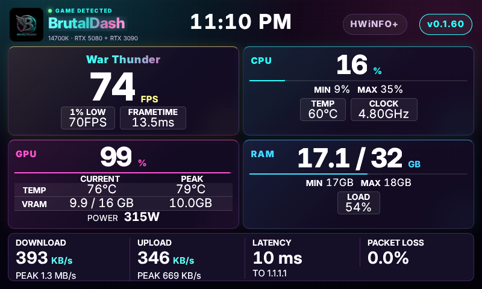
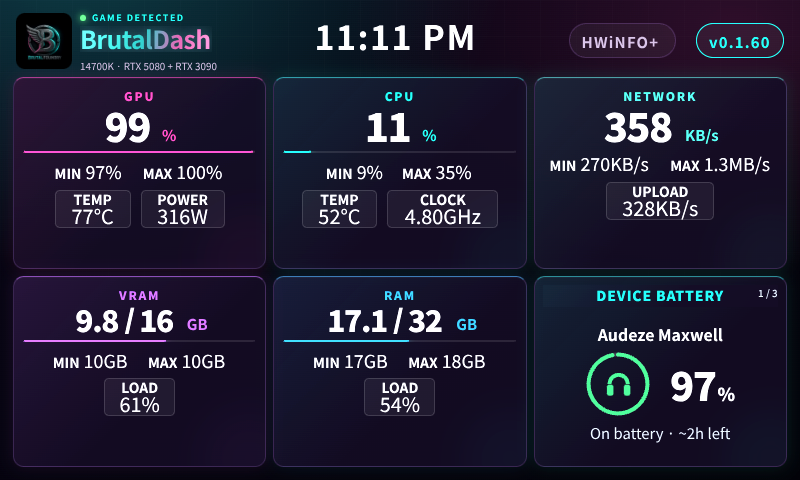
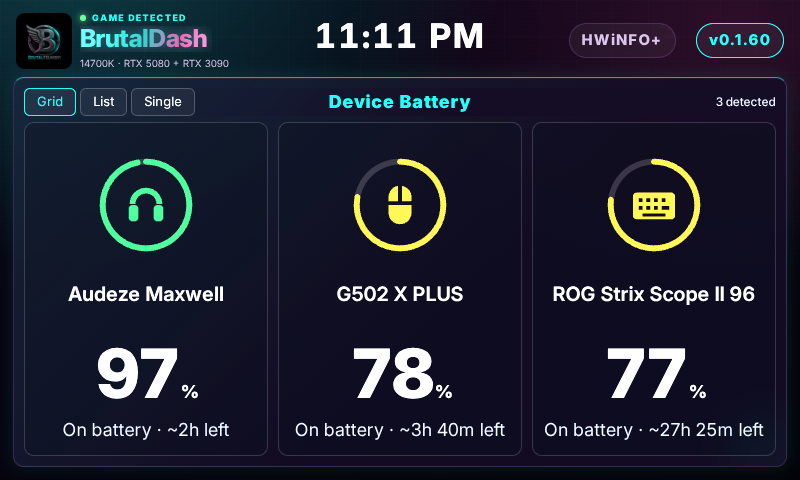

# BrutalDash

<p align="center">
  
</p>

**BrutalDash** turns a BridgeThing-powered Car Thing into a live Windows PC performance command center.

It is built for readability at a glance: near-live CPU, GPU, RAM, VRAM, disk, network, game detection, FPS, and frametime data on the device; a desktop-side layout editor; and a standalone clock when the PC connection is unavailable.

**New here?** Start with [INSTALLATION.md](INSTALLATION.md). For the full capability list, see [FEATURES.md](FEATURES.md).

**Current stable release: [v0.1.60](https://github.com/Brutal-BrutalFoundry/BrutalDash/releases/tag/v0.1.60).**

## Screenshots

Screenshots from v0.1.60. Hardware and readings shown are examples from one PC.

### Gaming Focus



### Six-card dashboard



### Device Battery



### LLM Monitor


## Highlights

- Native Windows telemetry out of the box: CPU, GPU, RAM, VRAM, disk I/O, storage capacity, and network throughput.
- Native in-game FPS, frametime, and game detection through bundled PresentMon.
- Bundled PawnIO CPU temperature, clocks, and power, with optional HWiNFO enrichment. Native CPU readings are preferred when available.
- Per-session minimum and maximum readings, with double-tap reset.
- Hold any card for 1.5 seconds, drag onto another, and release to swap. The arrangement saves automatically for that layout.
- Saved layout presets, themes, custom accent, glow, brightness, metric selection, and alerts.
- Shared custom display name and uploaded logo for the dashboard header and Foundry Digital clock.
- Gaming Focus combines GPU/VRAM and includes throughput, target-labeled latency, and rolling packet loss.
- Compact, PC-native media drawer with artwork, title, artist, progress, playback controls, and active-media volume.
- Digital and analog disconnected clock faces.

- Device Battery page with Grid, List and Single views, plus a battery card for any layout. Percentage colors, charging animation and learned time estimates.

- LLM Monitor with local inference and context readings, multi-GPU telemetry and total VRAM.
- Hold the physical dial to save a screenshot to your chosen PC folder.

## Requirements

- A BridgeThing-compatible Car Thing and BridgeThing Desktop **0.12.1 or newer**.
- Windows 10 or Windows 11 for the telemetry extension.
- HWiNFO is optional. To use expanded sensors, enable **Shared Memory Support** and keep Sensor Status running.

## Install

1. Download the current `BrutalDash-<version>.zip` from the repository's Releases page.
2. In BridgeThing Desktop, choose the option to install a webapp bundle and select the ZIP.
3. Grant the requested native-extension permissions. They are used only for local Windows telemetry, optional HWiNFO Shared Memory access, PresentMon FPS capture, Windows media sessions, local LLM monitoring, and saving screenshots to your chosen folder.
4. Activate BrutalDash on the Car Thing. Use **Customize** for layouts, cards, themes, clock faces, and sensor preferences.

To update, install the newer ZIP through the same flow. Do not uninstall first: the app keeps its saved dashboard state under the same app identity.

## Development

```powershell
npm install
npm run typecheck
npm run build
npm run share
```

`npm run share` creates an installable BridgeThing ZIP in the project root. The app is intentionally not published to npm.

## Third-party software

BrutalDash redistributes Intel PresentMon 2.5.1 for local FPS capture. Its license and notice are included in `public/vendor/presentmon/`. The bundled CPU host includes PawnIO and LibreHardwareMonitor-derived transport/modules with their notices in `extension/vendor/cpu-host/`; corresponding CPU-host source is in `native/cpu-host/`. Font licenses are in `src/fonts/`.

Battery providers and deduplication are adapted from [HaloBattery](https://github.com/HeyOkay/HaloBattery) under its included MIT license, alongside a separate ASUS reader. The bundled Python runtime and HID binding include their licenses in `extension/vendor/battery-host/`.

## License

BrutalDash is released under the [MIT License](LICENSE). Redistributed components remain subject to their own included licenses.

---

Built by [Brutal](https://github.com/Brutal-BrutalFoundry).
